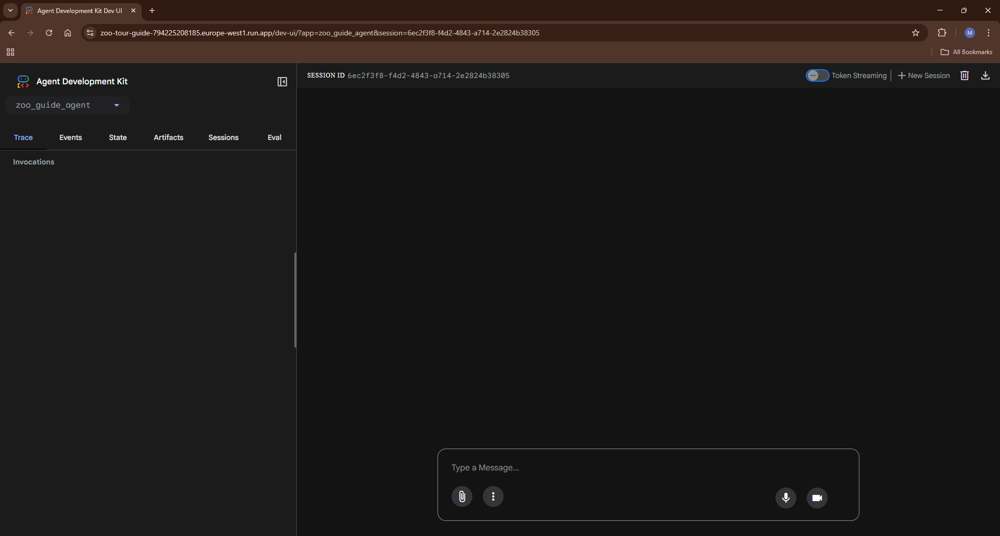
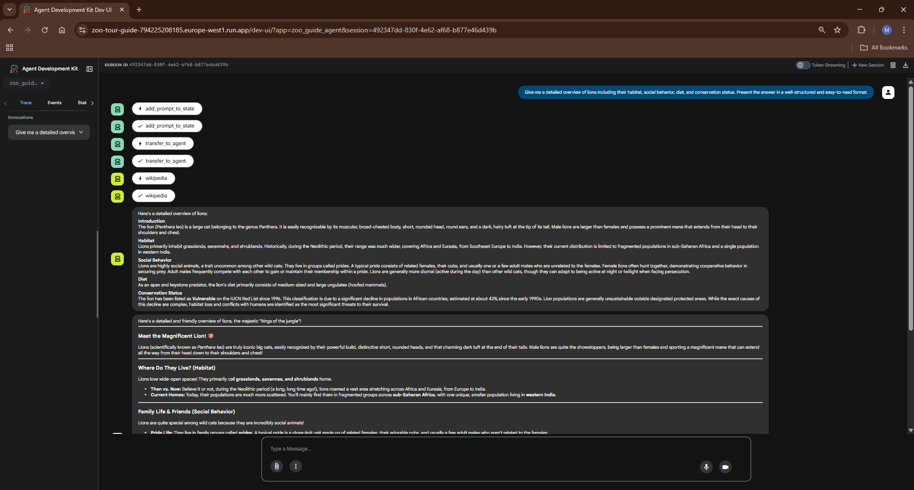

# Zoo Guide AI Agent 🦁🧭

AI-powered zoo tour guide that answers animal-related questions using **Wikipedia** + **Gemini** — implemented as a **tool-using, multi-agent** workflow and deployed on **Google Cloud Run**.


---

## 🔗 Live Demo

https://zoo-tour-guide-794225208185.europe-west1.run.app

---

## 🧭 Overview

Zoo Guide AI Agent is a production-style AI agent that:

- **Retrieves** animal information from Wikipedia using a tool call
- **Synthesizes** the research into a clear, friendly tour-guide response using Gemini 2.5 Flash
- Runs as a **multi-agent pipeline** (research → formatting) to keep responsibilities clean and debuggable

---

## ✨ Features

- 🛠️ **Tool-using agent** with Wikipedia integration (via LangChain)
- 🧩 **Multi-agent pipeline**: Researcher + Formatter
- ☁️ **Cloud Run deployment** for scalable, serverless serving
- 🖥️ **Interactive UI** via Google ADK Dev UI

---

## 🧠 Architecture (Text Diagram)

The core workflow is intentionally simple and composable:

```text
User
  │
  ▼
ADK Web UI
  │
  ▼
Root Agent (greeter)
  ├─ stores prompt in shared state (tool)
  ▼
Sequential Agent (pipeline)
  ├─ Researcher Agent ──► Wikipedia tool (retrieval)
  ▼
  └─ Formatter Agent ──► final response
```

Why this design:

- **Separation of concerns** (retrieval vs. formatting)
- **More reliable outputs** via tool-grounded research
- **Easy debugging** with clear agent boundaries and Cloud Logging

---

## 🧰 Tech Stack

| Category | Tech | Purpose |
|---|---|---|
| Language | Python | Agent implementation |
| Agent framework | Google ADK | Agent + workflow orchestration |
| Model | Gemini 2.5 Flash | Fast, high-quality responses |
| Tools | LangChain Community + Wikipedia | Retrieval & tool integration |
| Runtime | Google Cloud Run | Serverless deployment |
| Observability | Cloud Logging | Production-friendly logs |

---

## 🖼️ Screenshots

**UI**



**Example Response**



---

## 💬 Example Usage

**Input**

```text
Tell me about lions
```

**Output (example)**

```text
Lions are large cats found primarily in Sub‑Saharan Africa (and a small population in India).

- Habitat: Savannas, grasslands, and open woodlands
- Social behavior: Live in groups called prides
- Diet: Mostly medium-to-large ungulates; cooperative hunters
- Conservation: Threatened by habitat loss and human–wildlife conflict
```

---

## 🚀 Local Setup

### Prerequisites

- Python 3.x
- A Google Cloud project with access to Gemini
- Google credentials available via **Application Default Credentials (ADC)** (recommended)

### Install

```bash
python -m venv .venv
# Windows PowerShell:
.venv\Scripts\Activate.ps1

pip install -r requirements.txt
```

### Configure environment variables

Create a `.env` file using `.env.example` as a template.

Minimum required:

```bash
MODEL=gemini-2.5-flash
```

### Run the UI

From the project root:

```bash
adk web
```

Open the local URL printed in the terminal, select the agent, and start chatting.

---

## ☁️ Deployment (Cloud Run)

High-level steps:

1. Deploy the service to Cloud Run (source or container)
2. Set Cloud Run environment variables from `.env.example`
3. Ensure the Cloud Run service account has permissions to call Gemini

Example (environment variables):

```bash
PROJECT_ID=your-project-id
PROJECT_NUMBER=your-project-number
SERVICE_ACCOUNT=your-service-account
MODEL=gemini-2.5-flash
```

---

## 📚 Key Learnings

- 🧠 Multi-agent pipelines improve maintainability by isolating responsibilities
- 🛠️ Tool-use (Wikipedia retrieval) increases groundedness and reduces hallucination risk
- ☁️ Shipping to Cloud Run highlights the importance of IAM + env configuration, not just code
- 🔎 Observability (logging) is essential for debugging agent behavior in deployment
